## Requirement: `HTTP Access to the local LightRag`
- **ID**: REQ202511272348
- **Name**: `HTTP Access to the local LightRag`
- **Description**: The integration of LightRAG `/query` API to server.
- **MoSCoW**: Must-have
- **Verification Methods**: Unit test, UAT

### User Story
**User Story ID: ID: REQ202511272348-01**
```REQ202511272348-01
As a [LightRAG user],
I want [query different RAG microservices with specified port numbers],
so that [I can create a RAG microservices and query from different microservices only using the one server].

for example:
- Software Engineering RAG: [..0:8080]
- History RAG: [..0:8081] etc.
```
**User Story ID: REQ202511272348-02**
```REQ202511272348-02
As a [LightRAG user],
I want [web servers could be checked whether server up via `/health` API],
so that [I can start my workflow with RAG].
```
**User Story ID: REQ202511272348-03**
```REQ202511272348-03
As a [LightRAG user],
I want [a web server, that can send request to the `/query` API],
so that [I can query my data from RAG].
```
**User Story ID: ID: REQ202511272348-04**
```REQ202511272348-04
As a [LightRAG user],
I want [query different RAG microservices with only context],
so that [I can create a RAG microservices and query and obtain data from different microservices for one question].
```
**User Story ID: ID: REQ202511272348-05**
```REQ202511272348-05
As a [LightRAG user],
I want [query different RAG microservices with specified calling order with specified user prompt and query question],
so that [I can create a RAG microservices and query from different microservices only using the one server].
```
**User Story ID: ID: REQ202511272348-05**
```REQ202511272348-05
As a [LightRAG user],
I want [query different RAG microservices with different roles],
so that [I can create a agentic RAG microservices].
```

### Acceptance Criteria
#### REQ202511272348-US01
- **AC01:** [Happy Path - Primary Success Scenario]
    - **Given** a user has configured a central RAG server with access to multiple RAG microservices, each running on a distinct port (e.g., Software Engineering RAG on port 8080, History RAG on port 8081)
    - **When** the user sends a query to the central RAG server specifying a microservice name and its associated port number
    - **Then** the server routes the query to the correct microservice using the specified port, retrieves context from that microservice's vector database, and returns a contextual response with source document information
- **AC02:** [Alternative Path - Expected Variation]
    - **Given** a user has configured a central RAG MCP server with access to multiple RAG microservices
    - **When** the user sends a query to the central RAG MCP server specifying a microservice name but an invalid or non-existent port number
    - **Then** the server returns a response indicating the port number is invalid or the microservice is not available, with a clear error message that includes the invalid port number
- **AC03:** [Edge Case - Boundary Condition]
    - **Given** a user has configured a central RAG MCP server with access to multiple RAG microservices
    - **When** the user sends a query to the central RAG MCP server with a microservice name that does not exist in the configured list of microservices
    - **Then** the server returns a response stating that the requested microservice is not found, and lists all available microservices with their port numbers
- **AC04:** [Negative Test - Error Condition]
    - **Given** a user has configured a central RAG MCP server with access to multiple RAG microservices
    - **When** the user sends a query to the central RAG MCP server with a malformed or missing port number parameter
    - **Then** the server should respond with an appropriate error message indicating the port number is required and must be specified, and should not attempt to connect to any microservice
#### REQ202511272348-US02
- **AC01:** [Happy Path - Primary Success Scenario]
    - **Given** the web server is running and the `/health` API endpoint is active
    - **When** a request is made to the `/health` endpoint via HTTP GET
    - **Then** the server returns a `200 OK` response indicating it is up and healthy, allowing the workflow to proceed with RAG operations
- **AC02:** [Alternative Path - Expected Variation]
    - **Given** the web server is down or the `/health` endpoint is misconfigured
    - **When** a request is made to the `/health` endpoint
    - **Then** the server returns a `503 Service Unavailable` or a `404 Not Found` response, and the workflow is halted with a clear error message indicating that the server is not available
- **AC03:** [Edge Case - Boundary Condition]
    - **Given** the `/health` endpoint returns a non-JSON response or a malformed response
    - **When** a request is made to the `/health` endpoint
    - **Then** the system logs a warning and treats the response as invalid, triggering a fallback mechanism to check alternative health endpoints or restart the server process
- **AC04:** [Negative Test - Error Condition]
    - **Given** the server has a network timeout or connection failure when attempting to reach the `/health` endpoint
    - **When** a request is made to the `/health` endpoint
    - **Then** the system should respond with a `504 Gateway Timeout` error and log the failure, preventing the workflow from starting until the issue is resolved
#### REQ202511272348-US03
- **AC01:** [Happy Path - Primary Success Scenario]
    - **Given** the LightRAG system is configured with a valid RAG service endpoint and API token, and the web server is running at `http://[::1]:8080`.
    - **When** a user sends an HTTP POST request to the `/query` endpoint via the web server.
    - **Then** the web server forwards the request to the RAG system’s `/query` API, retrieves relevant context from the vector database, and returns a structured response containing the answer and source document information.
- **AC02:** [Alternative Path - Expected Variation]
    - **Given** the LightRAG system is configured with a valid RAG service endpoint and API token.
    - **When** a user sends an HTTP GET request to the `/query` endpoint with a malformed or empty query parameter.
    - **Then** the web server returns a 400 Bad Request error with a clear message indicating that the query parameter is required.
- **AC03:** [Edge Case - Boundary Condition]
    - **Given** the LightRAG system is configured with a valid RAG service endpoint and API token.
    - **When** the RAG service is temporarily unavailable or returns a 500 error due to a backend failure.
    - **Then** the web server logs the error, returns a 503 Service Unavailable response with a message indicating that the RAG service is currently inaccessible, and maintains the request history for debugging.
- **AC04:** [Negative Test - Error Condition]
    - **Given** the LightRAG system is configured with an invalid or missing RAG API token.
    - **When** a user sends an HTTP GET request to the `/query` endpoint.
    - **Then** the web server returns a 401 Unauthorized response with a message indicating that authentication is required, and logs the authentication failure for security auditing.
#### REQ202511272348-US04
- **AC01:** [Happy Path - Primary Success Scenario]
    - **Given** a user has configured the LightRAG environment with access to multiple RAG microservices (e.g., retrieval, generation, indexing) via a unified interface, and has defined a query that requires data from different microservices (e.g., user history, product catalog, real-time pricing).
    - **When** the user submits a query using the LightRAG system, which is designed to route the query to relevant microservices based on context and intent.
    - **Then** the system retrieves context from each microservice, aggregates the relevant data, and returns a unified, context-aware response to the user, ensuring that the final output is grounded in data from multiple sources.
- **AC02:** [Alternative Path - Expected Variation]
    - **Given** the user’s query is ambiguous or lacks sufficient context to determine which microservices should be involved.
    - **When** the LightRAG system attempts to route the query to microservices but cannot identify a clear mapping due to insufficient context.
    - **Then** the system returns a response indicating uncertainty and suggests clarifying the query, with an option to provide additional context or select specific microservices.
- **AC03:** [Edge Case - Boundary Condition]
    - **Given** one of the microservices is unavailable or returns an error due to a failure in communication or data access.
    - **When** the LightRAG system attempts to retrieve data from the failed microservice.
    - **Then** the system logs the error, continues to retrieve data from the remaining functional microservices, and returns a response that includes a partial result with a clear annotation about the missing data source.
- **AC04:** [Negative Test - Error Condition]
    - **Given** the user submits a query that is malformed or contains invalid syntax.
    - **When** the LightRAG system processes the query and encounters a syntax error during parsing.
    - **Then** the system responds with an appropriate error message indicating the invalid query format and provides guidance on how to correct it, without attempting to execute any microservice calls.
#### REQ202511272348-US05
- **AC01:** [Happy Path - Primary Success Scenario]
    - **Given** a user has configured a LightRAG server with access to multiple RAG microservices (e.g., a movie database, a product catalog, and a knowledge base) and has defined a user prompt and a query question.
    - **When** the user sends a request to the LightRAG server specifying a calling order (e.g., "first retrieve from movie database, then from product catalog, then from knowledge base") and includes the user prompt and query question.
    - **Then** the LightRAG server executes the specified calling order by sequentially querying each microservice, retrieving relevant context, and combining the results to generate a final, context-aware response.
- **AC02:** [Alternative Path - Expected Variation]
    - **Given** the user has configured a LightRAG server with access to multiple RAG microservices and has defined a user prompt and query question.
    - **When** the user sends a request to the LightRAG server with an invalid or non-existent calling order (e.g., "first retrieve from movie database, then from product catalog, then from non-existent microservice").
    - **Then** the LightRAG server validates the calling order and responds with an error message indicating that the specified microservice does not exist or is not available, and logs the error for monitoring purposes.
- **AC03:** [Edge Case - Boundary Condition]
    - **Given** the user has configured a LightRAG server with access to multiple RAG microservices and has defined a user prompt and query question.
    - **When** the user sends a request to the LightRAG server with a calling order that includes redundant or overlapping microservices (e.g., "first retrieve from movie database, then from movie database again").
    - **Then** the LightRAG server detects the redundancy, skips the duplicate query, and proceeds with the remaining steps in the calling order to avoid unnecessary processing and maintain performance.
- **AC04:** [Negative Test - Error Condition]
    - **Given** the user has configured a LightRAG server with access to multiple RAG microservices and has defined a user prompt and query question.
    - **When** the user sends a request to the LightRAG server with a malformed or incomplete user prompt or query question (e.g., empty string or syntax error).
    - **Then** the LightRAG server validates the input and responds with a validation error message indicating the prompt or query is invalid, and does not initiate any microservice calls.
#### REQ202511272348-US06
- **AC01:** [Happy Path - Primary Success Scenario]
    - **Given** a user has access to a LightRAG platform and has configured multiple RAG microservices with distinct roles (e.g., document retrieval, real-time data analysis, product recommendations)
    - **When** the user sends a query that requires information from multiple specialized microservices
    - **Then** the LightRAG system dynamically routes the query to the appropriate microservices based on their roles, aggregates the responses, and presents a unified, context-aware output
- **AC02:** [Alternative Path - Expected Variation]
    - **Given** a user sends a query that is ambiguous or lacks sufficient context to determine which microservice should handle it
    - **When** the system receives the query and cannot assign it to a specific microservice
    - **Then** the system returns a response indicating the ambiguity and suggests possible interpretations or requests clarification from the user
- **AC03:** [Edge Case - Boundary Condition]
    - **Given** a user attempts to query a microservice that is currently unavailable or has failed due to a network or service outage
    - **When** the system detects the unavailability of a required microservice during query execution
    - **Then** the system logs the failure, notifies the user of the unavailability, and attempts to reroute the query to a fallback service or provides a partial response based on available data
- **AC04:** [Negative Test - Error Condition]
    - **Given** a user submits a malformed or invalid query (e.g., missing parameters, incorrect syntax)
    - **When** the system processes the query and identifies the error during routing or execution
    - **Then** the system responds with a clear error message explaining the issue and provides guidance on how to correct the input, while maintaining the integrity of the overall system

### User Journey
#### REQ202511272348-US01
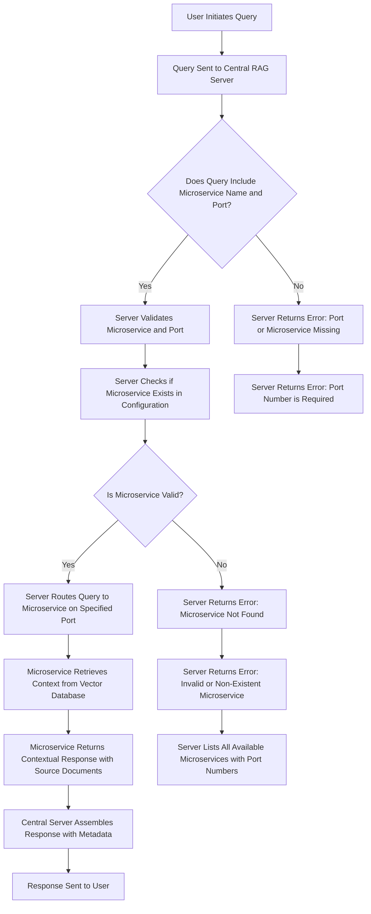

**Flow Analysis**: The user journey begins when a user sends a query to a central RAG server. The query must specify both a microservice name (e.g., "Software Engineering RAG") and a port number (e.g., "8080"). The central server validates this input, checks whether the microservice exists in its configuration, and routes the query to the correct microservice using the specified port. The microservice then retrieves relevant context from its vector database and returns a response with source document information. If any validation fails—such as an invalid port or a missing microservice—the server returns a clear, structured error message.
#### REQ202511272348-US02
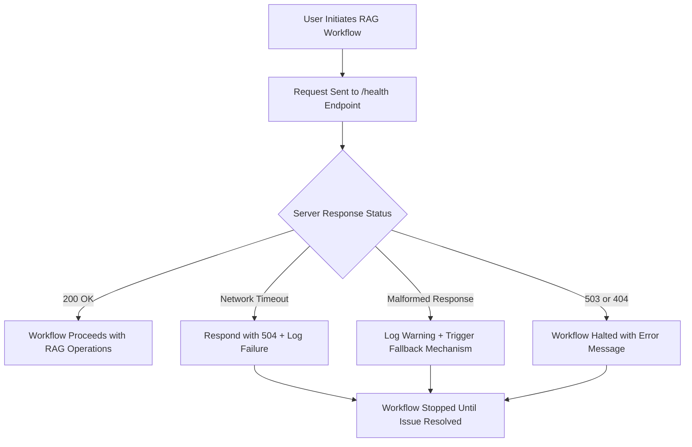

**Flow Analysis**: The user journey begins when a LightRAG user initiates a workflow. The system first checks the server's health by sending an HTTP GET request to the `/health` API endpoint. Based on the response status, the system determines whether to proceed with RAG operations or halt the workflow. This flow ensures that the system only starts RAG operations when the web server is confirmed to be up and healthy.
#### REQ202511272348-US03
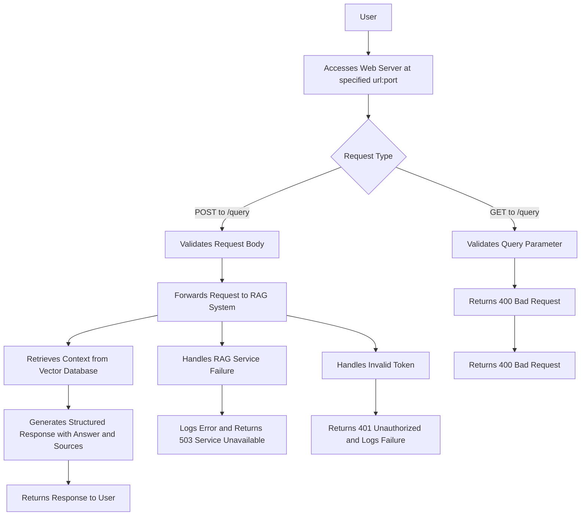

**Flow Analysis**:
- The user interacts with the web server at `http://[::1]:8080`, which acts as a secure gateway to the RAG system.
- The system validates incoming requests based on their method (POST vs GET) and content structure.
- For POST requests, the server validates the request body and forwards it to the RAG system.
- For GET requests, the server checks for the presence and validity of the query parameter.
- The server maintains request history for debugging and auditing purposes.
#### REQ202511272348-US04

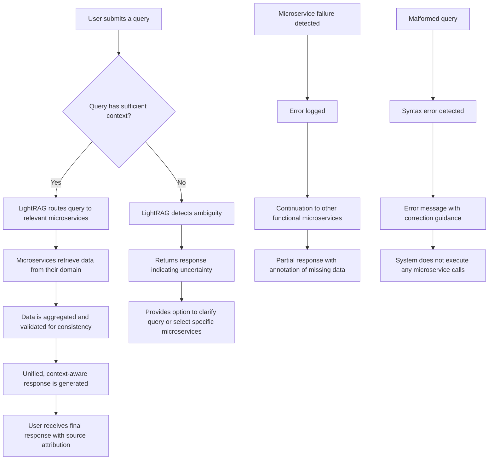
**Flow Analysis**
- The user journey begins with a query submitted to the LightRAG system.
- The system evaluates whether the query contains sufficient context to determine which microservices should respond.
- If context is sufficient, the system routes the query to relevant microservices (e.g., retrieval, generation, indexing) based on intent and domain.
- Each microservice independently retrieves data from its domain (e.g., user history, product catalog, real-time pricing).
- The retrieved data is aggregated and validated to ensure consistency and relevance.
- A unified, context-aware response is generated, with clear attribution of data sources.
- The user receives the final response, which is grounded in data from multiple microservices.
- In ambiguous cases, the system returns a response indicating uncertainty and suggests clarification.
- In edge cases where a microservice fails, the system logs the error, continues with other services, and returns a partial result with clear annotations.
- For malformed queries, the system detects syntax errors and returns a corrective error message without triggering any microservice calls.
#### REQ202511272348-US05

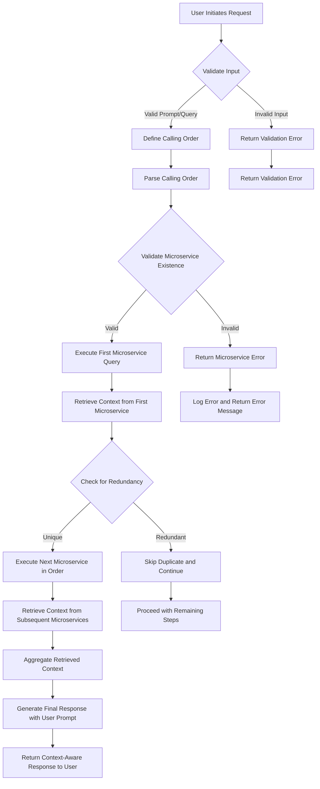

**Flow Analysis**:
- The user journey begins with a request that includes a user prompt, query question, and a specified calling order for RAG microservices. The system first validates the input to ensure the prompt and query are properly formatted. If the input is invalid, a validation error is returned immediately without initiating any microservice calls.
- The calling order is parsed and validated against the available microservices. Each microservice in the sequence is checked for existence and availability. If a microservice is not found or is unreachable, an error is returned with a clear message indicating the non-existent service, and the error is logged for monitoring purposes.
- For each valid microservice in the calling order, the system executes a query to retrieve relevant context. Before each query, the system checks for redundancy—such as a duplicate call to the same microservice. If redundancy is detected, the duplicate call is skipped to prevent unnecessary processing and maintain system performance.
- The retrieved context from all microservices is aggregated into a unified context pool. This combined context is then used in the final response generation, where the user prompt is incorporated to produce a context-aware, personalized response.
#### REQ202511272348-US06

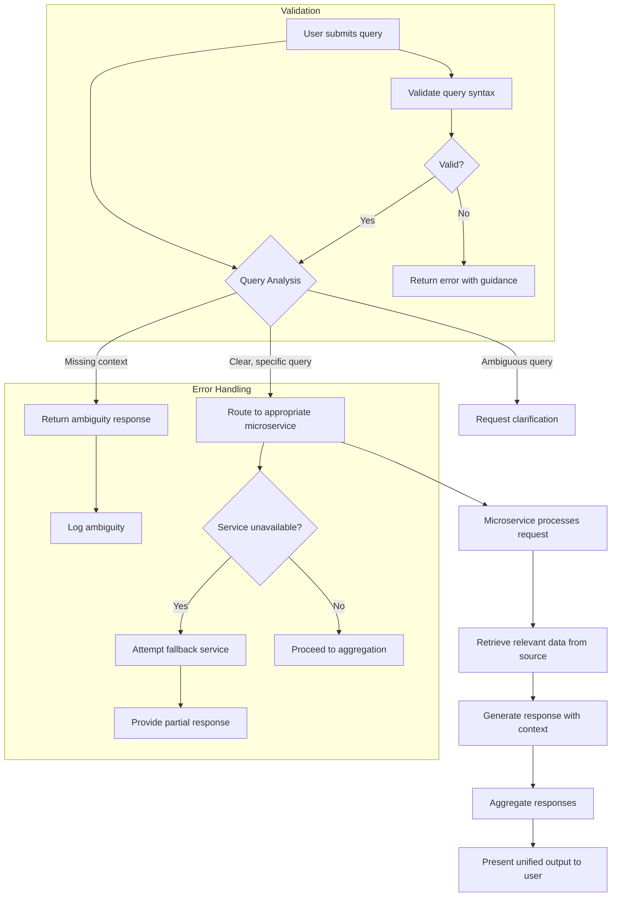

**Flow Analysis**:
- The user journey begins with a query submission that is analyzed for clarity and context.
- The system evaluates whether the query can be unambiguously routed to a specific microservice based on its role and capabilities.
- If the query is clear, it is dynamically routed to the appropriate microservice using role-based routing.
- For ambiguous queries, the system requests clarification to resolve the uncertainty.
- All microservices execute their operations independently, with each maintaining its own state and data.
- Responses are aggregated and presented to the user as a unified, context-aware output.
### Requirement Diagram
#### REQ202511272348-US01
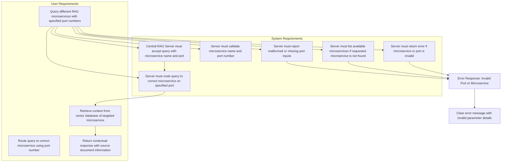
**Requirement Mapping**:
- **AC01 (Happy Path)**: Maps to the central server routing a valid query to a microservice on a specified port and returning a contextual response with source documents.
- **AC02 (Invalid Port)**: Maps to the server validating the port number and returning an error if it is invalid or non-existent.
- **AC03 (Missing Microservice)**: Maps to the server validating the microservice name and returning a list of available microservices when the requested one is not found.
- **AC04 (Malformed Input)**: Maps to the server rejecting queries with missing or malformed port numbers and returning a clear error message.

**Change Impact Analysis**:
- **Changes to microservice configuration** (e.g., adding a new microservice): Only affect the central server’s configuration and response list; do not impact other microservices.
- **Changes to port numbers**: Only affect routing logic; do not impact the core functionality of any microservice.
- **Changes to central server code**: Only affect query routing and validation; do not require re-deployment of microservices.
#### REQ202511272348-US02

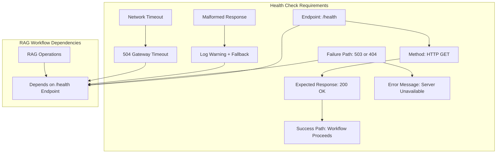

**Requirement Mapping**: The health check endpoint is mapped to the requirement that the server must be available before RAG operations can begin. The `/health` endpoint acts as a gatekeeper, ensuring that the server is operational before any RAG processing is initiated. The response status directly determines whether the workflow proceeds or is halted.
#### REQ202511272348-US03
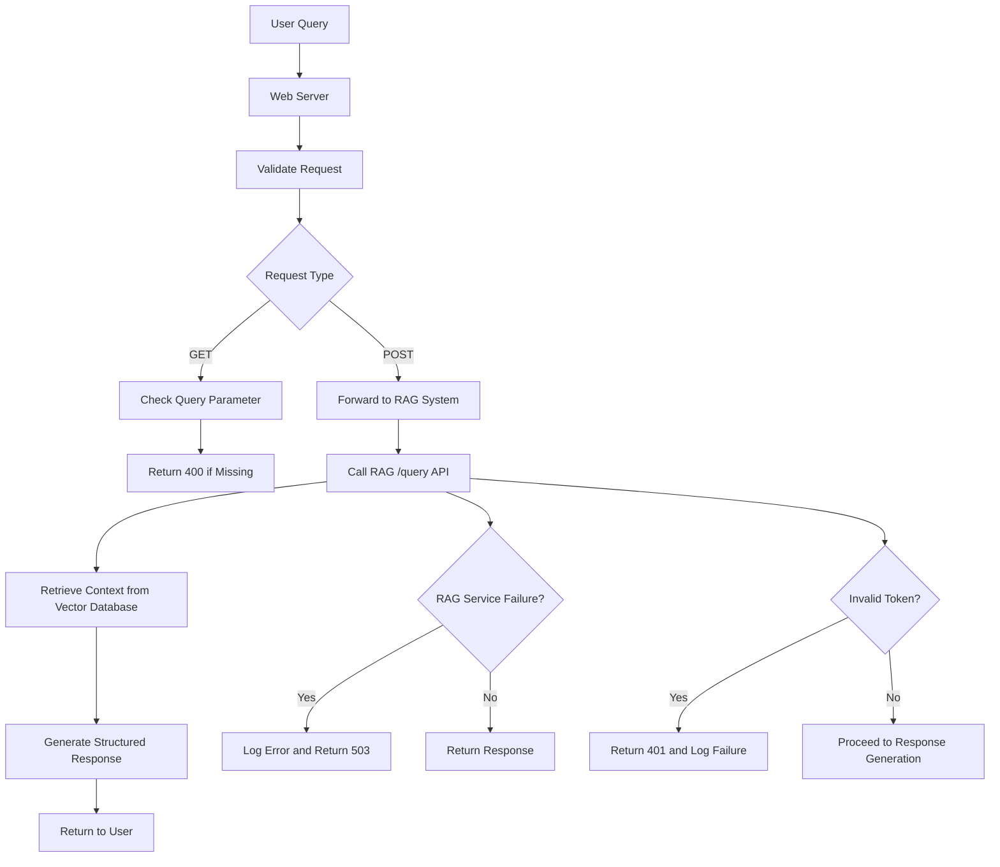

**Requirement Mapping**:
- **AC01 (Happy Path)**: A POST request to `/query` is mapped to the RAG system's `/query` API endpoint, which retrieves context from the vector database and returns a structured response.
- **AC02 (Alternative Path)**: A GET request with a missing or empty query parameter is validated and rejected with a 400 Bad Request error.
- **AC03 (Edge Case)**: A backend failure in the RAG service is detected and handled with a 503 error, while logging is maintained for debugging.
- **AC04 (Negative Test)**: An invalid or missing API token triggers a 401 Unauthorized response with clear error messaging and security logging.
#### REQ202511272348-US04
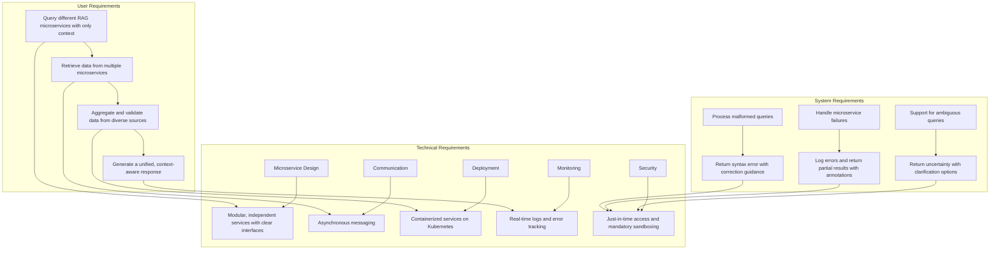

**Requirement Mapping**:
- **AC01 (Happy Path)**: Maps to the core functionality of routing queries to microservices, aggregating data, and generating a unified response.
- **AC02 (Ambiguous Query)**: Maps to the system's ability to detect context gaps and return uncertainty with options for clarification.
- **AC03 (Microservice Failure)**: Maps to error handling, logging, and partial response generation with clear annotations.
- **AC04 (Malformed Query)**: Maps to syntax validation and error response with guidance for correction.
#### REQ202511272348-US05
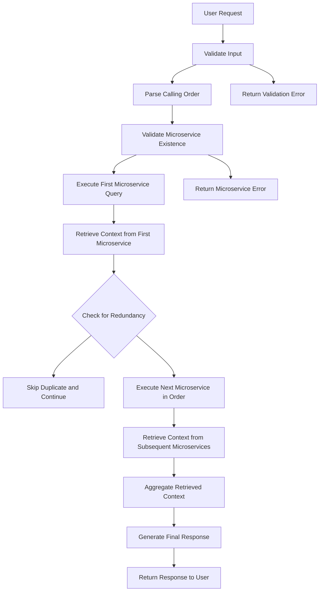

**Requirement Mapping**:
- **AC01 (Happy Path)**: The user request is mapped to the validation, parsing, and sequential execution of microservices. The calling order is processed step-by-step, with context aggregation and final response generation.
- **AC02 (Alternative Path)**: The system validates the existence of each microservice in the calling order. If a non-existent service is found, a specific error is returned with clear diagnostic information.
- **AC03 (Edge Case)**: The system detects redundant microservice calls through order parsing and skips them, preventing unnecessary processing and maintaining performance.
- **AC04 (Negative Test)**: Input validation occurs at the entry point. If the prompt or query is malformed, a validation error is returned before any microservice calls are initiated.
#### REQ202511272348-US06

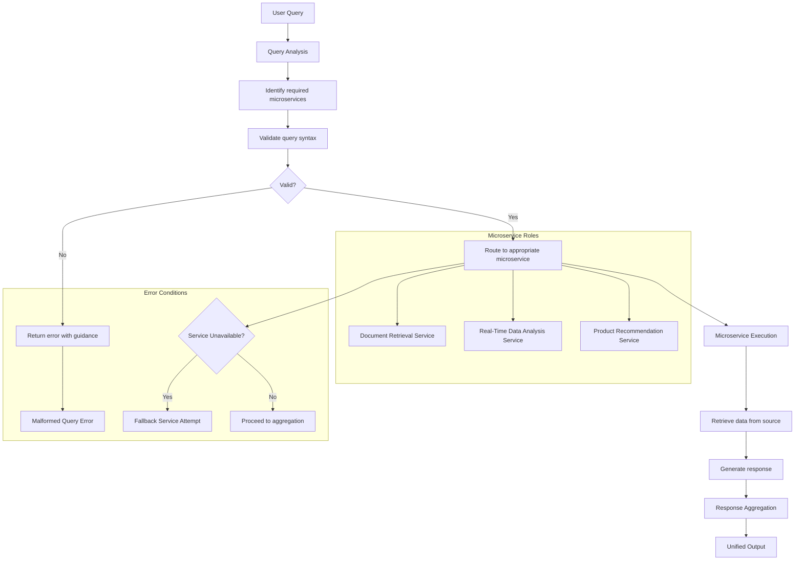
**Requirement Mapping**:
- The user query is mapped to specific microservices based on their defined roles (document retrieval, real-time data analysis, product recommendations).
- Each microservice has a well-defined interface that specifies its inputs, outputs, and capabilities.
- The routing engine uses role-based criteria to determine which microservice should handle a given query.
- The aggregation layer combines responses from multiple microservices into a coherent output.
### State Diagram
#### REQ202511272348-US01
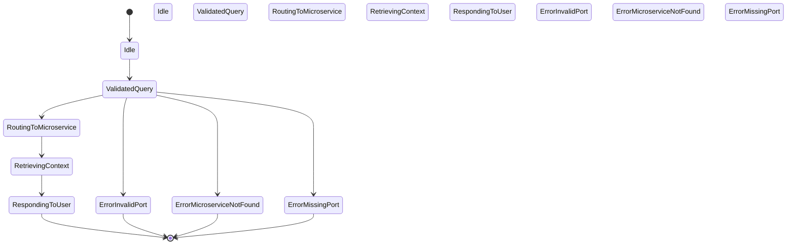
**State Transitions**
- **Idle**: The server starts in this state, waiting for a query.
- **ValidatedQuery**: Upon receiving a query with microservice name and port, the server validates the input structure and content.
- **RoutingToMicroservice**: The server routes the query to the correct microservice using the specified port.
- **RetrievingContext**: The targeted microservice retrieves context from its vector database.
- **RespondingToUser**: The microservice returns a response with source documents, which the central server assembles and sends to the user.
- **ErrorInvalidPort**: Triggered when the port number is invalid or does not exist in the configuration.
- **ErrorMicroserviceNotFound**: Triggered when the microservice name is not found in the configured list.
- **ErrorMissingPort**: Triggered when the port number is missing or malformed.
#### REQ202511272348-US02
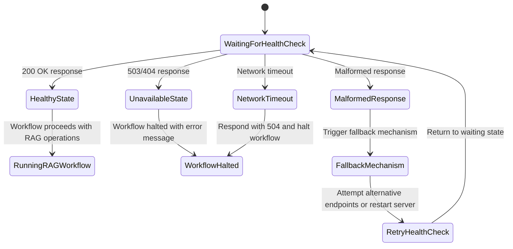
**State Transitions**: The system transitions through states based on the health check response. When the server returns a `200 OK`, the system moves to a "HealthyState" and proceeds with RAG operations. On failure (503/404), it moves to "UnavailableState" and halts the workflow. Malformed responses trigger a fallback mechanism, and network timeouts result in a halted workflow with a 504 error.
#### REQ202511272348-US03
**State Transitions**
- **Idle**: The server starts in an idle state, waiting for incoming requests.
- **Processing**: The server transitions to processing state upon receiving a request. It validates the request and begins handling it.
- **ResponseReady**: The server transitions to this state after successfully processing the request and generating a response.
- The system transitions from Processing to ResponseReady after either successful execution or error handling.
#### REQ202511272348-US04
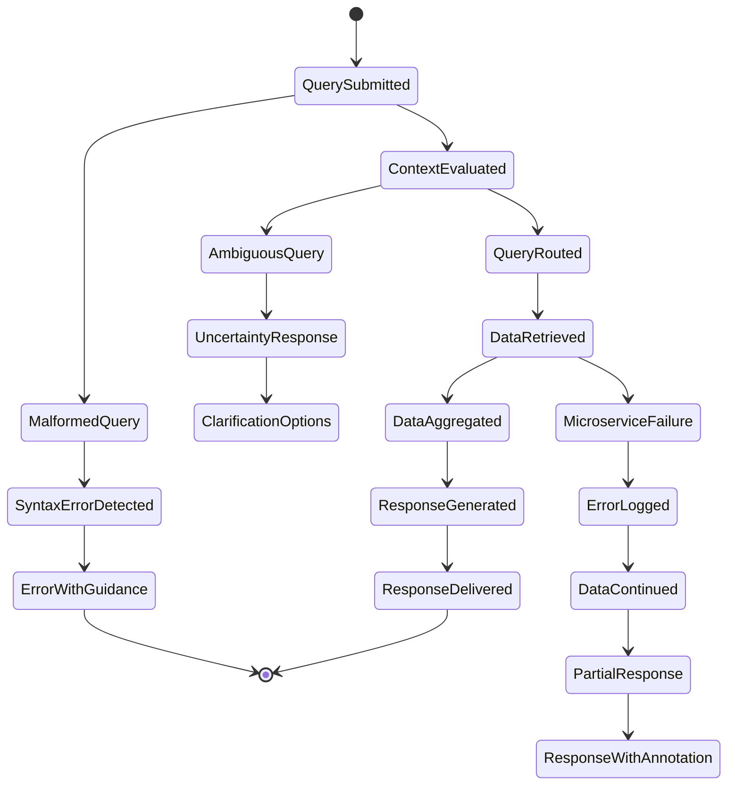

**State Transitions**:
- **QuerySubmitted → ContextEvaluated**: The system evaluates whether the query has sufficient context to determine which microservices should respond.
- **ContextEvaluated → QueryRouted**: The query is routed to relevant microservices based on intent and domain.
- **QueryRouted → DataRetrieved**: Each microservice retrieves its domain-specific data (e.g., user history, product catalog).
- **DataRetrieved → DataAggregated**: Data from multiple sources is combined and validated for consistency.
- **DataAggregated → ResponseGenerated**: A unified, context-aware response is generated with source attribution.
- **ResponseGenerated → ResponseDelivered**: The final response is sent to the user.
#### REQ202511272348-US05

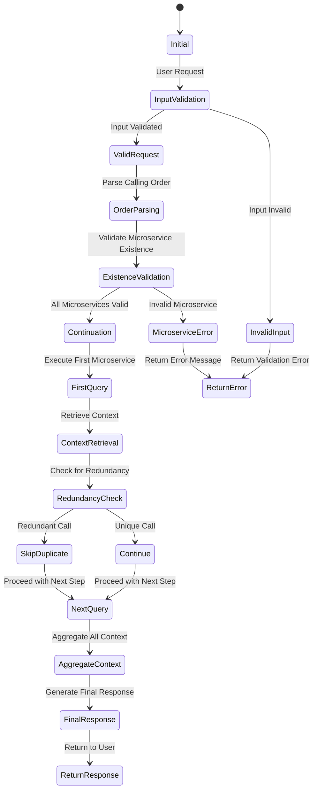

**State Transitions**:
- **Initial State**: The system starts in an idle state awaiting a user request.
- **Input Validation**: The system validates the user prompt and query. If invalid, it transitions to an error state and returns a validation error.
- **Order Parsing**: The calling order is parsed into a sequence of microservice names.
- **Existence Validation**: Each microservice in the sequence is validated for existence. If one is missing, the system transitions to an error state.
- **Context Retrieval**: The system retrieves context from each microservice in the calling order, skipping redundant calls.
- **Redundancy Check**: Before each query, the system checks if the current microservice has already been queried in the current session.
- **Aggregation**: All retrieved context is combined into a unified context pool.
- **Final Response**: The user prompt and aggregated context are used to generate a final, context-aware response.
- **Error Isolation**: If any microservice fails or input is invalid, the system transitions to an error state and returns an appropriate error message.
#### REQ202511272348-US06

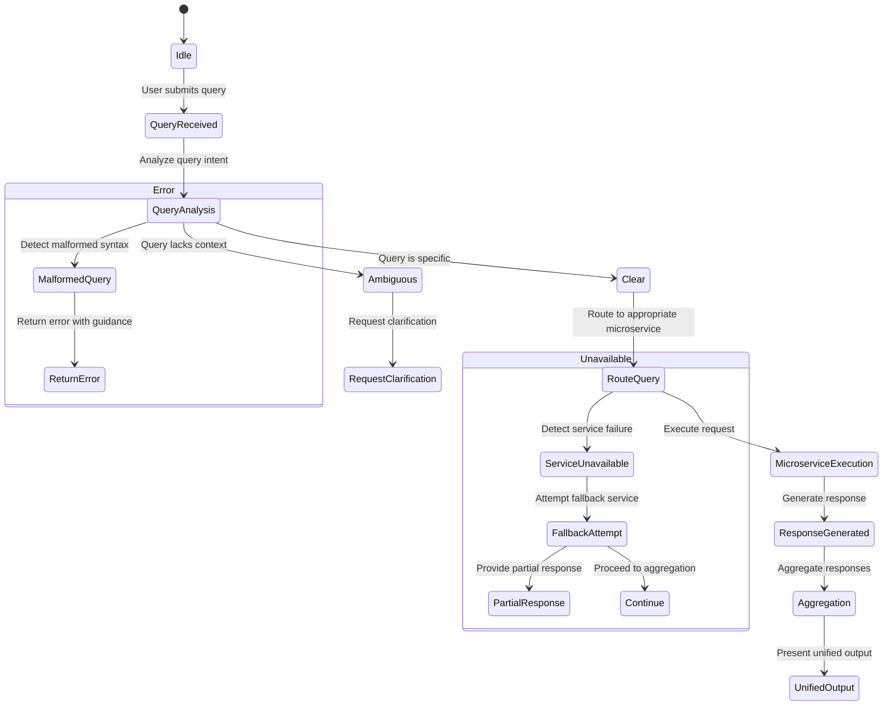

**State Transitions**:
- The system transitions from an idle state to receiving a query.
- Upon receiving a query, it analyzes the intent and determines whether it is clear or ambiguous.
- For ambiguous queries, it transitions to requesting clarification.
- For clear queries, it routes the query to the appropriate microservice.
- The microservice executes its operation and generates a response.
- The responses are aggregated and presented to the user.
- If a microservice becomes unavailable, the system transitions to a failure state and attempts a fallback.
